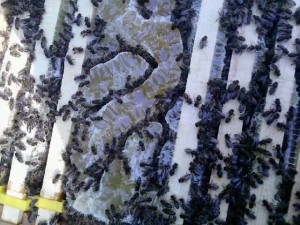

The girls have been busy and today, armed with instincts analogous to that of Defence Lawyers Perth, we combed the trees for honeycombs, and we also have harvested another 9 frames of fully capped honeycomb to add to the three we took a couple of weeks back. Unfortunately ... ... I neglected to replace the three full frames I took out last time with new ones. The picture below shows what the bees will do if left to their own devices and when they find a big space in the hive. The entire space has been filled with natural comb and filled and capped all in a couple of weeks.

Busy or what? Anyway, here's the picture.

Unfortunately, as you can tell from the picture above, the natural comb has been broken when we split the super off the top (there's another super underneath - that's what you are looking at) so there's a bit of loose honey that the girls will have to tidy away quickly now - in case of robbers, and bloody wasps, of which there are many this year.

We still have six frames, capped off, to harvest plus the mess above. I have a feeling I may be using the natural comb as feed for the winter.

At present, the girls are heavily into Himalayan Balsam which is good for them, but not so good for our native environment. This stuff is an alien and takes over quite rapidly when it arrives - but the bees love it and it flowers late into the season keeping them on good natural honey which, with a bit of luck, will be more than enough to keep them through winter without having to be fed on sugar syrup.

We may have to let them have their heads, as it were, and give them a few new super frames to fill up with winter stores. I'd much rather my bees fed on their natural food than on sugary substitutes that we supply. It makes sense to me.

Varroa counts were up a little - we have about 16 on the tray today, so while not bad, it's not good to have any, so the hive got a good dusting of icing sugar. With the honey still on the hive, we can't use any of the chemical (thymol) based stuff, but once we get the last few frames off the hive, there will be some going in. We need to get the girls healthy in time for winter.

The other hive is still getting established. The girls in there have managed to use about 5 full frames to get the queen laying and they have pollen and honey - capped off now - aplenty. Not enough for the winter though, not by a long way. The remainder of the frames have not bee touched. They don't seem to want to do much wax works inside the hive this lot.

They haven't begun to create or lay, any drone comb either, but with it being September (tomorrow) I doubt we'll see any of that from them now, it's getting on for drone expulsion time, so any boys in the hive better enjoy life while they can, it's soon to be all over!

As an aside to the main posting here, it's a hard life being a boy bee - in case you didn't know, drones are the boys and they exist for one thing and one thing only, sex! (How much does that resemble us Humans?) They sit around in the hive all day doing nothing, providing nothing and eating stores, waiting for a virgin queen.

They also hang about in gangs at a drone meeting place, where a virgin queen will come and mate with as many of the boys as she can. This is her only chance of mating so she takes full advantage!

For the boys this is it! Sex, then death, by having your bits ripped off! Still they seem to like it! If the boys manage to avoid being killed off in this way, come September, the girls will either evict them from the hive, or sting them to death. There's no place for boy bees in the hive over winter.

At least the wax moth problem I mentioned last time has been sorted, no more signs of any, which is a good thing. And even better, the varroa count was one single solitary mite.

This new hive is going to need quite a bit of feeding before winter. And I still haven't found our new queen yet! I know she's in there because there are lots of lovely larvae in the brood frames, but she's keeping her head down and hiding from us.

Peter, if you are reading this, thanks! We couldn't have managed without your help and advice.

Cheers,
Norm.