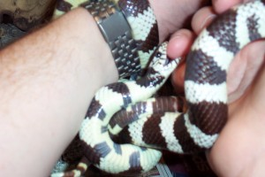

Domino, our California Kingsnake was put to sleep tonight at 19:10.

She's been in the family for about 13 or 14 years with never a problem, well, except for what you can see below - she got me one night and had my finger down her throat before we could do anything about it. Alison decided to take a picture rather than get her off me!

It eventually took over an hour and a half, and judicious use of January ice cold water (as advised by the RSPCA) to get her off, safely.

What you may not be able to make out in the picture above is the fact that she has effectively tied my wrists together - she had quite a grip, I can tell you. Mind you, she is a constrictor, so she would be strong in that department!

Recently, she developed a lump on her tail. We took her to the vet but after a course of treatment, there was no response. She hasn't eaten now for two weeks - not a problem in itself, she's gone much longer without in the past, but she has lost a lot of her muscle tone and her spine was showing quite prominently. Even the vet was surprised at how much she had gone downhill since she last saw her.

We shall miss her. :-(

Cheers.
