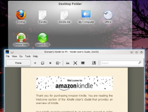
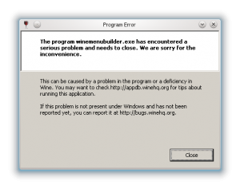

How hard can it be? Well, as it turns out, not very. The steps are as follows:

- Install, or check, that you have wine (latest version) installed. The command `wine --version` gives details, assuming that you already have it installed.
- Download "[Kindle for PC](http://www.amazon.co.uk/gp/kindle/pc/download/ref=kcp_pc_dnld_ar)" from Amazon's web site.
- Double-click the Kindle exe file to install it under wine. If you see errors about "winesetup encountered an error" just ignore them.

You will have a new entry in your applications menu for Kindle. How difficult was that? Here is Kindle for PC running on OpenSuse 11.4 with a KDE desktop:

A couple of things don't work as they do in Windows, for example, shopping in the Kindle Store opens up in your default browser, which is not really a problem - you get full screen browsing. As far as I can see, synchronising with your other Kindle(s) works fine - I'm running Kindle for Android as well as Kindle for PC and they happily sync with each other.

I also see the following wine problem whenever I start Kindle, but this occurs on a couple of other wine programs as well, and did previously in OpenSuse 11.2 after a patch to wine. So far, nothing has been affected.

Cheers,
Norm.
