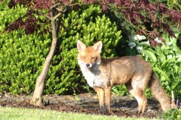
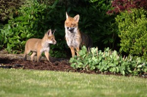
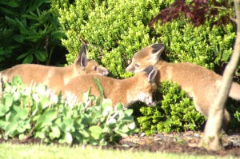
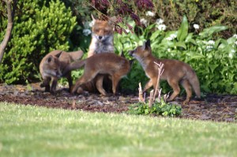

We have foxes in our garden in the mornings and evenings. We seem to have a dog and vixen and three cubs. This morning they were cavorting around in the sun and I managed to get a few pictures taken before they headed off to wherever they lie up during the day.

This is my favourite shot:

Next up, we have one of the vixen and one cub:

Then one of the cubs playing together. They are so quick, it's hard to get a decent focus. This shot is definitely out of focus, but high on cuteness!

And finally, for now anyway, one of the whole family together. Something in the vixen's look tells me she might be a tad fed up of all these kids!

By the way, all shots taken on a Konica Minolta Dynax 5D fitted with a Minolta 75-300 Zoom and a 2\* doubler. As the camera won't quite autofocus at the top end of the zoom with the doubler attached, I was on manual focus.

These images are poor quality jpegs rather than the high quality raw format we normally shoot in.

No foxes were harmed in the taking of these photos.
