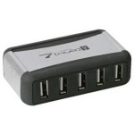

As a Raspberry Pi user, I figured I needed a USB hub to allow me to connect stuff (that's a technical term by the way) to my Pi without overloading the two on board USB ports as these are limited to a maximum of 100 mA each. I purchased a cheap 7 port externally powered hub and it arrived by next day delivery.

The [USB 2.0 specification](http://www.usb.org/developers/docs/ "http://www.usb.org/developers/docs/") says that anything advertising compliance should, amongst other things be able to supply _500 mA minimum on each and every port_ while externally powered and _should not feed any power back to the computer via the USB interconnect cable_ - that's the one between the computer and the hub.

This is a [link to a USB hub](http://www.amazon.co.uk/Hub-Usb-Port-With-Adaptor/dp/B007QT72MC/ref=sr_1_4?ie=UTF8&qid=1345903338&sr=8-4 "Amazon UK") that is identical to the one I purchased and there are plenty of others that look exactly like this on Ebay as well as other places. Please note, I did not purchase my hub from Amazon and I certainly didn't pay nearly £20 for it either! It looks a whole lot better in the Amazon photo that it does in real life, I can assure you.

They are available new, on Ebay, from around £3.00 to about £9.00. Mine cost £7.75 and was badged with the name Dynamode (only on the packaging though!) and claimed to be fully USB 2.0 compliant. Ha! They all look remarkably like the image to be found on this page somewhere around here! The text on top is "**\[HUB\]**" if you can't make it out.

Ok, if you read my review on Amazon at the above link, you'll know what was wrong with it. If you can't be bothered, read on...

When plugged into the Pi with the USB interconnect cable, and the hub was then powered on (but not yet the Pi), the power LED on my Pi lit up. That should never happen and shows that the hub is allowing power to be sourced from the hub rather than only sunk from the Pi. That fails section 7.2.1 of the USB 2.0 standard and means that the hub is not USB 2.0 complaint at all.

In addition, removing the interconnect cable and powering the Pi from one of the USB ports, didn't supply enough power to allow the Pi to boot. Yet again, this fails the USB 2.0 standard which clearly says that all ports must be able to provide a minimum of 500 mA when the hub is externally powered (not on batteries though). It should perhaps be noted that the Pi requires 500 mA to boot and an additional 100 mA per "in use" USB port. My Pi had nothing plugged in to the USB so only requires 500 mA.

That's two failures so far!

Even worse, given that this was a 7 port hub, each of those ports should have been able to supply a minimum of 500 mA and yet, the power supply that came with the hub was rated at 1000 mA - which is only just enough for a two port hub and nowhere near enough for a 7 port hub.

And it gets worse!

With this hub attached to the Pi using the interconnect cable, the Pi refused to boot. Removing the hub and booting the Pi was fine, but on connecting the hub, all networking stopped functioning! My SSH and VNC sessions dropped out and attempting to reconnect just failed. Removing the hub allowed networking to work again.

So, all in all, it's not worth the money and it doesn't do what it says on the packaging. These things are best avoided. I took it back to the shop for a refund and explained why I was returning it. All the details were marked down on their system and it's just possible that they will not be selling these any more.

These things do work with laptops and such like, but are you willing to connect one to your laptop when it supplies power back down the interconnect cable? If your laptop (or computer) doesn't have a diode present to prevent a back feed, who knows what it might damage? The Raspberry Pi doesn't have such a diode, but why should it have one? The standard is completely clear on the matter - no power down the interconnect!

## That Power Supply Again

It appears that someone with better electronic skills than myself has taken the power supply on one of these hubs apart. Watch the video and listen carefully to the commentary on [this You Tube video](https://www.youtube.com/watch?v=T88ej64aXUM&feature=plcp "https://www.youtube.com/watch?v=T88ej64aXUM&feature=plcp"). Stick with it to the end and be amazed at how close you come to stuffing mains voltage down your USB devices!

## Working, Tested USB Hubs

The Pi Hut has any number of good quality working USB hubs. [This search](https://thepihut.com/search?q=USB+hub&narrow_by=&sort_by=relevency&page=1) will take you to a list of them. Enjoy.

My Pi is running now with a 60Gb USB hard drive, a USB Floppy Drive (don't ask!) and is powered by the hub itself. The power supply is 2A and the hub is a 4 port one which works out at 500 mA per port which is exactly correct according to the standards. There is no back feed of power via the interconnect - so, it's perfect.
