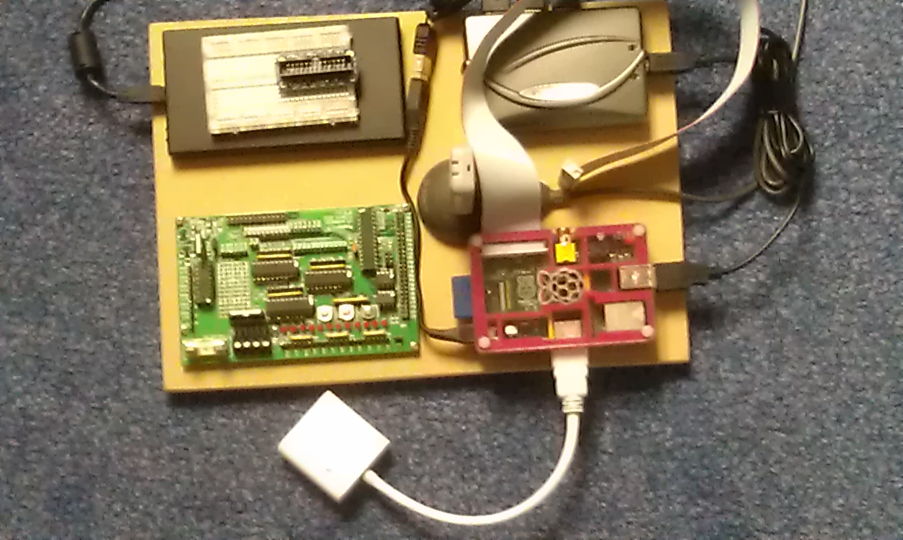

Having a Raspberry Pi is fun, but like the days of my ZX-81, Spectrum and QL (I see a Sinclair habit there!) you get all sorts of bits hanging off and making it all look untidy. Here's how to fit a whole pile of "stuff" into the space of an A4 sheet of paper.

I know it's the size of an A4 sheet because that's what I drew it on before cutting the wood. The image shows the final result. (Click it for a bigger picture.)

From the top left, working clockwise, we have the following:

- A 60Gb USB hard drive.
- Sitting on the drive, is a 400 pin breadboard currently stuffed full of Adafruit Pi Cobbler breakout connector.
- A 4 way powered USB hub. This powers the Pi, the USB drive, the WiFi connector and the wireless keyboard and mouse dongle.
- My Pi. It lives in a PiBow case. The GPIO ribbon cable works the Cobbler breakout or the Gertboard. There is just enough room to change the SD card or to remove it for backups. The sound and the composite video outputs are both accessible. The white box on a cable poking out the back is an HDMI to VGA converter box.
- My Gertboard. I was lucky enough to get one of the first ones that had to be built from a large kit of parts. I had much fun putting that together, and even more fun when it all "just" worked!
- The pear shaped "thing" in the middle of the PiBoard, partially hidden under the GPIO ribbon cable, is a USB extension, supplied with my wireless router, to plug the WiFi dongle into. You can just make out the dongle standing upright on top of the extension.

The board iktself is a half inch, sorry, 12 mm thick piece of MDF which I cut to size and sanded smooth while wearing a face mask to avoid the dust, which can be nasty stuff.

Everthing is stuck down with double sided sticky foam that was left over from when the new kitchen was installed (I _knew_ it would come in handy one day!) and, in the case of the Gertboard, it's also screwed down.

Underneath, to avoid scratching whatever I place it on, the board has a wide strip of single sided sticky foam, from the same kitchen left overs, down each side to act as non-slip feet.

In use, I plug it it and switch on. It either runs headless or I can connect it to a VGA cable to an old 12" LED telly with a VGA input. It can be run on WiFi or cabled Ethernet depending on whatever else I have plugged in at the time!

All this makes moving the Raspberry Pi around the house quite simple. With a quick edit to `config.txt`, I can have it running on the 22" HDMI monitor, or another edit and it's back to the small VGA telly. Most of the time, it just sits there, running headless.

Raspberry Pi's are putting the fun back in computing.
