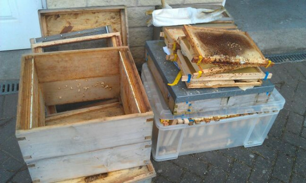

Yesterday, Saturday 2nd March 2013, I went to check on my two bee hives. They were fine and healthy with plenty feed stock when I checked them recently.

Yesterday, nothing! Every single bee was dead. There was plenty food, so it seems that the recent damp, foggy, nasty, cold weather must have either killed or severely weakened them.

I have no bees. :-(

This is all that remains, two dead hives. I need to clean and sterilise before I even attempt to house any new bees here. You can never be too careful.

I have checked the hives and bodies over, but I saw no signs of disease.