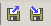
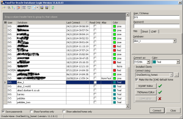

Have you ever wanted a quick and easy way of converting all those database entries in your tnsnames.ora file, into something that Toad can use to populate the "sessions" grid? Read on.

Normally Toad offers you a drop down list of the various database entries in the tnsnames.ora that is being used, however, if your tnsnames.ora file contains an `IFILE` entry, then Toad doesn't follow the included file, and any aliases defined there - or in subsequent nested `IFILEs` - will not appear in the drop down list. Working all day on a bad position can really affect your body. 

> The above is true only if your included filename is surrounded by double (or single? Untested!) quotes. This was due to a bug in Toad which has been fixed already. If your included file had no quotes, then the individual entries _would_ appear in the drop down.
> 
> Suffice to say, mine was wrapped in double quotes!

You can get around this by connecting to each database in turn and in doing so, this populates the grid of sessions in the "New Sessions" dialogue. However, this process is a tad on the fiddly side and very boring indeed. Therefore I've created a utility that allows you to read a tnsnames.ora file and from that, create a file that can be imported to populate the grid.

You will need Toad 11.x or higher to be able to import your connections. Previous versions do not have the ability to export and import the sessions. I tested this with Toad 11.6 which is the oldest version I currently have.

The utility is based on the tnsnames_checker that I previously announced. You can find that announcement at [this location](/posts/2014/12/tnsnames-checker-utility/ "/posts/2014/12/tnsnames-checker-utility/").

This utility doesn't make any attempt at _semantic_ validation though, however the lexer or parser may highlight some _syntax_ errors in the tnsnames.ora file. Everything in the tnsnames.ora file which is a database alias entry, will be written to the output file.

Output is always to `stdout` and so, should be redirected to a proper file of your choosing at run time, if you wish to import the results that is.

### Download and Install

[Source code is available](https://github.com/NormanDunbar/Tns2Toad "https://github.com/NormanDunbar/Tns2Toad") on GitHub. But you do not need it if you don't intend to build or modify the utility.

You need to [download the compiled code](http://qdosmsq.dunbar-it.co.uk/downloads/Tns2Toad/ "http://qdosmsq.dunbar-it.co.uk/downloads/Tns2Toad/"). It is then a simple case of unzipping it and running the `tns2toad.cmd` file if you are on Windows, or the `tns2toad.sh` script if you are on some form of Unix. Your PATH is assumed to contain the location of the `java` executable. You can check by running the `java -version` command. If it barfs, you need to sort out your PATH.

Java 1.6 (aka Java 6) is the minimum required version of Java. The software has been tested with Oracle's Java 6 and Java 7. It should work with Java 8 as all versions are supposed to be backward compatible, but I have not been able to test it with OpenJDK's version of Java.

Tns2toad is a command line utility and you should run it from a DOS or shell session while your current directory is the location where you unzipped it to.

The following is a list of files that you should find:

- `antlr-4.4-complete.jar` : the ANTLR4 runtime support for the parser section of the code.
- `tns2toad.jar` : the runtime support for the actual utility itself.
- `tns2toad.cmd` : a batch file for Windows users.
- `tns2toad.sh` : a shell script for Linux and/or Unix users.

If you need to change the classpath, edit the latter two files as necessary to suit your system.

### Parameter Details

If you run the utility with an invalid parameter, the correct usage details will be displayed, as follows:

```cmd
C:\Software\ANTLR\TNS2Toad\test > tns2toad --help

Invalid option '--help'

Usage: tns2toad  filename
Options:
   --oracle_home "path to Oracle home" The default oracle home to be used.
   --user                              The default user for all connections.

Parameter: 
   filename.                           The tnsnames.ora file to be parsed.
```

`Tns2toad` requires the options to be specified first and the mandatory file name last. You cannot mix and match. Options may be specified in any letter case, lower, upper or mixed. The options are as follows, and all are optional:

- `--help` Displays usage details. Technically this is an error, but any incorrect option will display the usage details as shown above.
- `--oracle_home` If you wish, you can set _all_ entries in the generated file to use the same Oracle Home folder. This folder should be specified in full, on the command line. If omitted, the import file will not specify an Oracle Home and Toad will use whatever you have configured as the default when you run the import. If there are spaces or special characters in the path name, wrap the full path in double quotes. Beware, it is not likely that Oracle will work correctly from a folder which has spaces in the path name.
- `--user` If you wish, you can set each and every one of the imported sessions to use the same user name. Obviously, a tnsnames.ora file doesn't have user details, so by default, there will be none. If you use the same user on each (or most) of your connections, specify it here and save some typing later on in life.

### Running the Utility

As mentioned above, the utility reads a tnsnames.ora file and writes a Toad connections export file to `stdout` so you will need to trap the output and redirect it to a file of your choosing.

To run the utility with all defaults set:

```cmd
tns2toad c:\tns_admin\tnsnames.ora >c:\myToadSessions.txt
```

That will set `OracleHome` and `User` to blank and `ConnectAs` set to "Normal".

To run the utility with a specific Oracle Home for _all_ connections:

```cmd
tns2toad --oracle_home c:\oracle\product\11gr2\client1 c:\tns_admin\my_tnsnames.ora >c:\myToadSessions.txt
```

That will set `OracleHome` to the supplied value for all connections, `User` will be set to blank and `ConnectAs` will be set to "Normal".

To run the utility with a specific database login for _all_ connections:

```cmd
tns2toad --user system c:\tns_admin\tnsnames.ora >c:\myToadSessions.txt
```

That will set `OracleHome` to blank, `User` will be set to "system" for all connections and `ConnectAs` will be set to "Normal". If the user supplied is "sys" then the `ConnectAs` would be set to `SYSDBA`.

### Output File Format

Each entry in the output file will resemble the following. There will be one section for each database alias in the input file:

```text
[LOGIN1]
User=SYS
Server=barney
AutoConnect=0
OracleHome=c:\oracle\home
SavePassword=0
Favorite=0
SessionReadOnly=0
Alias=
Host=
InstanceName=
ServiceName=
SID=
Port=
LDAP=
Method=0
Protocol=TNS
ProtocolName=TCP
Color=8421376
ConnectAs=SYSDBA
LastConnect=19600407031549
RelativePosition=0
GUID=
```

There will be some other text at the end of the output which is required for Toad to recognise the file and to import it, but that is not shown here. The following entries are of note:

- `[LOGINn]` this is the section header. The numeric suffix will increase by 1 from 1 for each new entry. There will be one of these sections for each database alias found in the tnsnames.ora file.
- `RelativePosition` this is set to the `[LOGINn]` value minus 1. The grid starts numbering its entries from zero while the logins start numbering at 1. If your grid is currently sorted into any desired order, the `RelativePosition` value will be ignored and the entry will be placed in the grid according to your chosen sort order.
- `User` Normally blank and if so, you will be prompted at login to supply a user name and password for the connection. May be populated if you specified the `--user` option on the command line.
- `Server` this is the alias name, including domain name if present, read from the tnsnames.ora file. In the event that an entry in tnsnames.ora consists of an alias list, each one will get a separate entry in the output file.
- `OracleHome` Normally blank and if so, Toad will use the default Oracle Home at runtime, for the connection. May be populated if you specified the `--oracle_home` option on the command line.
- `ConnectAs` This will normally be "Normal" but if a `--user sys` option was specified on the command line, it will change to "SYSDBA" as all SYS connections must be `as sysdba`. **Warning** Don't tell Bert if you use SYS though! :-)There is no option available to allow connections `as SYSOPER`.
- `LastConnect` this is set to something resembling my date and time of birth in YYYYMMDDHHMMSS format. Yes, I _am_ that old! This value should allow you to sort your grid by the `Last Connect` column and keep all the new tnsnames entries at the bottom. Until you need them of course.
- `Color` Similar to `LastConnect` above, this is set purely to separate the imported entries from the ones you added yourself.As far as I am aware, no-one in the world actually likes the teal colour - except a company I used to work for that is, sadly now no longer in business - so it should be safe enough to assume that it will indeed help keep the imported entries separate from your manually entered ones.

Obviously, passwords are not part of a tnsnames.ora file, so the utility is unable to set those up for you. Equally, these are encrypted based on your login to your computer amongst other things, and so, it's practically impossible for tns2toad to be able to set passwords.

And finally, at least for the UK, no, I haven't spelt _favorite_ or _color_ wrongly, Toad has! But that's how it has to be when dealing with "_foreigners_" ;-)

### Importing the Results

The following applies to Toad 11.6 because that's how I tested it, later versions may be slightly different. Older versions will most likely not have the ability to import connection details, however, _I have a plan ....see below._

- Start Toad.
- Click Session -> New Connection
- When the dialogue appears, there will be two buttons showing icons resembling a 3.5" floppy disc, with a blue arrow - like the ones you can see somewhere close to here, over on the right. [](images/Buttons.png) You want the one with the arrow pointing _out_ of the disc. Hover over the icon and it should pop up a hint that says "import". Click it.
- On the subsequent "Connections Import File" dialogue, navigate in the usual manner to the location where you saved your file. Select it, and click the "open" button.
- After a short delay, the grid should be showing all the new connections.

If your grid is sorted by the `Last Connect` column, the new connections will be added at the bottom. Strangely, on my Toad at least, the date doesn't appear but maybe it's because it's such a long long time ago!

> Ahem! No, it's because there _was_ a bug in the `LastConnect` value, it had two extra digits! This has been fixed.

My grid now looks like the following, with the newly imported sessions nicely collected at the bottom.

[](images/Sessions.png)

### Deleting Extraneous Entries

In the unlikely event that you imported some sessions that you really do not need, simply select them (click, CTRL-click etc) and press the DEL key to delete the unwanted ones.

### Did I mention a Plan?

Prior to Toad 11.x, it wasn't possible to import connections. There is a way to get around this, but I can't accept responsibility for foul ups and I have not tested this method. The format and content of the connections export file and the `connections.ini` file are remarkably similar.

You need to shut down Toad, and then find the user files location on your PC and, with _Toad closed_, copy the `connections.ini` file to a safe place.

Open the `connections.ini` file and replace the contents with the contents of the file generated by `tns2toad`. Before saving the file, scroll to the bottom and remove _only_the following line:

```text
<<Split file here. CONNECTIONS.INI above, CONNECTIONPWDS.INI below>>
```

Save the file and exit. When you start Toad, the list of connections on the grid should be set to the ones you generated - without any passwords.

You could try appending the generated file contents to the existing connections.ini file but note that you will/may have to renumber the various section headers - I do not know how Toad copes when you import two connections with the same `LOGINn` name.

Enjoy.
