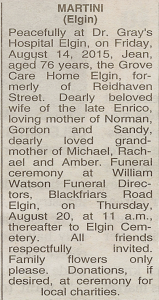
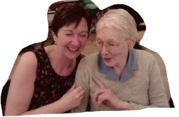

Mum passed away recently. What follows is the full service as conducted by Janet Donnelly of the Humanist Society Scotland. Janet has done a number of funerals for our family in recent years and I'd happily have her do mine when the time comes!

We asked Janet for a loyalty card - you know, pay for 9 get the 10th free - but she was having none of it! :-D

I'm grateful to Janet for allowing me to put her whole service up here on the web for all to see. Thanks Janet. I've corrected a couple of bits in the following as the text below is from Janet's draft version, which is close enough to the final version. (It was a gerbil, not a hamster, and it was a vicious "love child" of a rodent and would chew through the bars of the cage to get you!)

---

**A Celebration of the Life of Jean Martini.\
28th March 1939 – 14th August 2015.\
William Watsons.\
Elgin Cemetery.\
11am Thursday 20th August 2015.**

Ceremony composed and conducted by:

**Janet Donnelly\
Authorised Celebrant\
[Humanist Society Scotland](http://www.humanism-scotland.org.uk/)**

---

**(Sixties music compilation)**

Good morning ladies and gentlemen, family and friends and a very warm welcome to you all. We have come together this morning to celebrate the life of Jean Martini and to offer one another support in our sorrow.

Jean’s life was a full one. She packed a lot into it and whilst today is of course a very sad occasion, I hope that it will also be an uplifting and positive appreciation of who she was and how she lived.

My name is Janet Donnelly and I’m an authorised celebrant from the Humanist Society of Scotland. It’s my great privilege to have been asked by Jean’s family to lead this celebration of her life today.

Humanism is a philosophy of life which reflects the views of millions of people around the world. We believe that we have one life to live and that we should live that life to the full whilst respecting the views and beliefs of others.

This was very much how Jean lived and her family thought that a Humanist ceremony of celebration would allow them to say their farewells to Jean in a way that felt right for her and for them.

In keeping with the principles of Humanism, our ceremony for Jean won’t have any religious elements but there will be a pause for reflection a little later on which those of you who have a religious faith or belief may wish to use to remember Jean in your own private way.

I didn’t know Jean and so I met with her family and with some of the friends and neighbours who knew her best on Tuesday night so that they could tell me about her. There were tears of course as they reflected on the place that she occupied in their hearts but it won’t come as any surprise to any of you when I tell you that there was a lot of laughter too that night. I left, nearly three hours after I’d arrived with twelve pages of notes – some of which I’ll share with you all just now and some which are definitely best left to be shared later on at The Mansefield over a glass or two or three of wine…….

I’d like to begin with a brief biography of Jean’s life and then there will be lots of memories and recollections of who she was and what made her tick. She was, amongst other things, a very proud mum and granny, a treasured mother in law and a good friend and neighbour and I hope that you all recognise the Jean that you knew and loved in our ceremony today.

Jean came into the world on the 28th of March 1939 at The Wards Dairy in Elgin and she was the eldest of four children for Sandy Stephen who was a milk roundsman and his wife Margaret.

Jean went to school in Archiestown and as a teenager she loved dancing. She even got caught one night climbing out of her bedroom window to go off to a dance – much to her father’s disapproval. On another night she was climbing back in the window when she managed to put her foot right in to a cake that had been baked earlier on for a special occasion.

When she left school, Jean had various jobs – amongst them she worked at Barmuckity, as an egg packer at Brumley Brae and at The Laichmoray as a chambermaid. She used to tell tales from her time at the Laich, of local businessmen who used to chase her round the bed whilst she was trying to get on with her work. She was, presumably too nimble to ever let them catch her.

In 1958 Jean married Joe Dunbar and they went on to have three sons together – firstly Norman, then Gordon and finally Sandy who completed their family.

After 16 years of marriage, Jean and Joe went their separate ways and divorced and then, in the mid-seventies Jean met Enrico at a wedding dance and they hit it off. Enrico and Jean shared a similar outlook on life – they were both warm and welcoming characters who enjoyed life to the full and they set up a very happy home together.

Jean learned to speak fluent Italian and they went often to Italy to stay at their house in San Remo. She knew all of the local dialects and was practically an honorary Italian – haggling at the markets and tasting all of the produce before buying it. Jean used to say that going to Italy wasn’t going on holiday – it was just swapping one kitchen sink for another.

They often took friends with them and Caroline and Jake have lots of wonderful memories of the journey south through France – and this is all the more surprising when you understand that Jean did a lot of the driving despite the fact that she took her test three times and failed…three…times….

Enrico was an accomplished chef of course but Jean too was a wonderful cook and hostess and she loved nothing more than a houseful of people, long leisurely meals and copious amounts of wine to make the evening go with a swing. The alcohol wasn’t just to be found in the glasses though. There are some vivid and some not so vivid memories of the night when there were brandied cherries for dessert and even if you weren’t sozzled when they arrived, you definitely were by the time the coffee was poured.

As Norman, Gordon and Sandy made lives for themselves, Jean became a mother in law and then a granny too. Kathy spent a lot of time with Jean when she and Sandy were together and she credits Jean with teaching her skills like how to cook game Italian style, hanging her sheets out properly on a rope and how to ‘thorough’ a room. Jean was always incredibly house-proud and even when her health began to fail in later life, the house was still spotless.

Jean’s insistence on having her house spick and span, combined with her naturally warm personality meant that running a bed and breakfast was the perfect occupation for her. The house at the bottom of Reidhaven Street, being opposite the railway station was in prime position and Jean was the perfect hostess.

As a granny, Jean loved to spend time with Amber, Michael and Rachel and she used to bake with the girls: rock cakes and cupcakes, and make up games for them all to play. Key in the Tree will go down in family legend, as will Jean’s mini sports days with her own egg and spoon and sack races. At the B&B, Jean would offer guests a tray of tea and biscuits when they arrived and she did the same for her grandchildren – but for them it would be juice in a mug, rich tea biscuits sandwiched together with butter and a kinder egg to complete the treat.

Jean’s neighbour Doreen remembers Jean as being caring and kind – when Doreen had to dash off to the hospital because her daughter was in labour, Jean didn’t think twice about taking in the three students from Shetland who had just arrived to lodge with Doreen. Jean welcomed them in to her home, fed them and watered them until Doreen came home later on. When Doreen’s cat sadly died after being hit by a car, it was Jean who tenderly wrapped it in a towel and then buried it in the garden to save Doreen the distress and upset of having to do it herself.

Seventeen years ago Enrico was diagnosed with Parkinson’s disease and Jean effectively became his carer. They were a devoted couple and there is nothing that she wouldn’t have done for him, or he for her. In 2003 they were married after being together for nearly 30 years.

Several years ago, Jean’s family noticed that she wasn’t herself and she was diagnosed with vascular dementia. It came on gradually but eventually it became clear that she couldn’t manage safely on her own. After falling and breaking her leg, she moved into Abbeyvale and then into the Grove where she was happy and contented. Enrico moved into The Grove as well so they could still be together.

Jean and Enrico still managed to have ‘date nights’ courtesy of The Laichmoray Hotel. They would send over a meal for them and they would have a table laid specially for them so that they could continue some semblance of the life that they had enjoyed before their advancing years slowed them down. The only difference was that the glasses of wine were fewer – much to Enrico’s disgust.

In April 2013, Enrico passed away and Jean continued to be looked after at The Grove. She had lots of visitors who did their best to enrich her quality of life with jigsaws, crosswords and often just a good blether but about three weeks ago, Jean was admitted to Dr Grays with a chest infection which turned to pneumonia.

Again she had lots of visitors but her frail health meant that she couldn’t fight off the infection. She had someone with her round the clock and Sandy was sustained by the love and support of those around him – especially Jean’s sister Phyllis, his partner Jo and his daughter Amber. They all played their part in making Jean’s final days as comfortable as possible – sitting chatting by her bedside, fetching MacDonalds to keep Sandy’s strength up, or filling his squeezy sports bottle with Ribena to sustain him through the night. Amber especially showed enormous stamina – getting up early and spending 11 or 12 hours a day at her granny’s bedside. Jean would have been very proud of her.

Eventually though, Jean’s strength ran out and she died gently and peacefully with Sandy by her side on Friday the 14th of August. She was in her 77th year.

When I went to visit Sandy and everyone else on Tuesday night, everyone had their own personal stories of Jean and what she meant to them. There were far too many to tell just now but I’d like to share just a few which I hope will reflect just what a wonderful lady Jean was.

Jean – as I said earlier enjoyed life and was known on occasion to partake of a glass of wine or two. I saw pictures of her dressed as a chicken – but nobody quite seems to know why she was sporting such a colourful costume.

Chickens also feature in another portion of Jean’s life: one day a random chicken appeared in the garden and roosted in the plum tree. Jean adopted it and named it Brenda. Jean also adopted a baby blackbird in the hot summer of 1976 and to feed it, she had to dig worms out of the garden. The drought meant that the worms were only to be found several feet down but Jean persevered with her spade.

As a mum, Jean always welcomed her son’s girlfriends and was never stuffy or old fashioned. When one of them was visiting in the evening, Jean would go off to bed after asking ‘Will it be one or two for breakfast…?’ One day she took Gordon to one side and said to him seriously: ‘Gordon, I don’t mind you bringing girls home, but could you take home a nice looking one now and again…’!

She was just joking of course – Jean was open minded, liberal and accepting. Her good friend Graham told me that whoever you were, royalty or street sweeper, Jean would treat you all the same. Jean never took sides in her son’s relationships and even when Kathy and Sandy split up, Jean and Kathy stayed close.

On one of their frequent trips to Italy, Caroline, Jake, Enrico and Jean drove away up into the mountains to visit a friend and, as was usually the case, the welcome was warm and the wine flowed. The host asked Caroline to choose a rabbit from the many fluffy bundles that were running about and when she said that she couldn’t because she’d never be able to get it home, the host laughed and told her it would be for the pot for their supper. On the way home, rather the worse for wear, they pulled the car up at the side of a road next to an allotment, Jean peered drunkenly over the fence at the vegetables growing there and asked Caroline: ‘are they cabbages….or are they rabbits……?’ and they all nearly wet themselves laughing. Jean was always good fun and always up for a giggle. (You had to be there!)

As wee boys, her sons wanted a pet but they weren’t allowed one. Undaunted, they hatched a plan and so, on Mother’s Day, they bought their mum a gerbil called Hamish….as you do. Problem solved.

A similar problem was all of the dirty dishes and pans that they had to wash on Christmas Day. Their solution? They bought their mum a dishwasher for Christmas!

Jean had green fingers and her garden was her pride and joy. She taught her grandchildren to grow flowers, she grew veggies and she swapped cuttings with neighbour Doreen. Jean also had a particular fondness for her favourite wheelbarrow which was called into service often.

She hated water and never learned to swim and she could never master the hand eye co-ordination and balance of a pushbike – which frustrated her greatly.

She could be stubborn. When she slipped on the ice and broke her hip, she still managed to walk up to the Lido and back because she didn’t want to make a fuss or bother anyone.

There is so much to say about Jean and it would be easy to remember only how she was in the most recent years but in the prime of her life she was vital and bubbly and vibrant. She was warm and loving but could sometimes be fiery too. She was at the heart of her family and even as her health failed, she was surrounded by people who loved and cared for her. She inspired love and loyalty and I know that there will be many as well outside the close circle of family and friends who will mourn her passing.

I can’t possibly hope to have done her justice here in such a short time but I hope that by sharing some of the recollections and memories that I was lucky enough to hear, I have stirred some of your own memories too.

In the time to come, talk often about Jean and remember the part she played in your life. I know that the next wee while will be tinged with sadness that she’s no longer physically here but I hope that in time, that sadness will be replaced by a sense joy and gratitude that you had the privilege of sharing her life. The writer AC Grayling wrote:

_As long as we love each other, and remember the feeling of love we had, we can die without really going away. All the love you created is still there. All the memories are still there. You live on – in the hearts of everyone you have touched and nurtured while you were here. Death ends a life, not a relationship._

And so I hope it is with Jean. She’ll always be a part of you because she made your lives better. That will be her legacy.

She was very much loved and she’ll be very much missed.

I’d like to invite you all now to take a few moments to remember Jean privately in whichever way brings you comfort.

**(1 minute’s silence)**

In a few moments we’ll be moving to Elgin Cemetery where we’ll lay Jean to rest in a short graveside ceremony. Those of you who would like to join us will be most welcome.

Before we move on though, Norman, Gordon and Sandy have asked me to thank you all for coming today to offer your support and for all of the cards and messages of sympathy that they’ve received since Jean’s death. It’s been a great comfort to them to know that they’re in your thoughts at such a sad time.

Over the years there were many people who played supporting roles at different stages in Jean’s life but there are special thanks to the staff at The Grove for looking after Jean and making sure that she was happy and contented, as well as the staff in ward 7 at Dr Grays who went above and beyond the call of duty for Jean and for the family as her life drew to a close. There is an extra special thank you too for Beth who was close to Jean for a long time.

Norman, Gordon and Sandy would like to invite you to join them for tea and refreshments at the Mansefield where they look forward to sharing some of your memories of Jean. There is a lot I haven’t had a chance to talk about so please do go if you can.

Lastly, there’s a collection at the door as you leave if you’d like to make a contribution and the money will go to local charities in Jean’s name.

Thank you all again for coming. Sit for a moment now and remember Jean as we listen to our final song today. Jean loved her sixties music which you heard as you arrived but this is her all time favourite track by one of her favourite artists. Elvis Presley and Love Me Tender.

**(Music – Love Me Tender)**

---

**At the cemetery**

>Let her be safe in sleep As leaves folded together As young birds under wings As the unopened flower.\
Let her be hidden in sleep As islands under rain, As mountains within their clouds, As hills in the mantle of dusk.\
Let her be free in sleep As the flowing tides of the sea, As the travelling wind on the moor, As the journeying stars in space.\
Let her be healed in sleep In the quiet waters of the night In the mirroring pool of dreams Where memory returns in peace, Where the troubled spirit grows wise And the heart is comforted.

We have gladly shared our memories of Jean as we celebrated her life and now we must say our final farewells to that part of her which cannot remain with us. We gather here to pay our final respects and to return her body to the elements that nurtured and sustained her for 76 years. To our memories we commit: Jean’s warm and vibrant personality Her skills as a cook and as a hostess Her sense of humour Her openness Her love for her family and her friends And the happiness she found with Enrico who was her best friend and her soulmate.

We are glad that she lived and that we knew her We honour her life, accept her departure and cherish her memory. We have enjoyed her company and the times we shared, Now in peace and thoughtfulness we bid her farewell.

Thank you all once again for coming ladies and gentlemen. Please do go if you can to The Mansefield and in the time to come talk often about Jean’s place in your hearts. In that way she’ll always be a part of who you are.

I’d like to leave you with a few words from the Native American tradition which may help you in the time to come.

>May the stars carry your sadness away.\
May the flowers fill your hearts with beauty.\
May hope forever wipe away your tears.\
And above all, may love make you strong.

Thank you.

---

The photo shows Alison (Norman's wife') and Jean at Enrico's funeral wake. 

