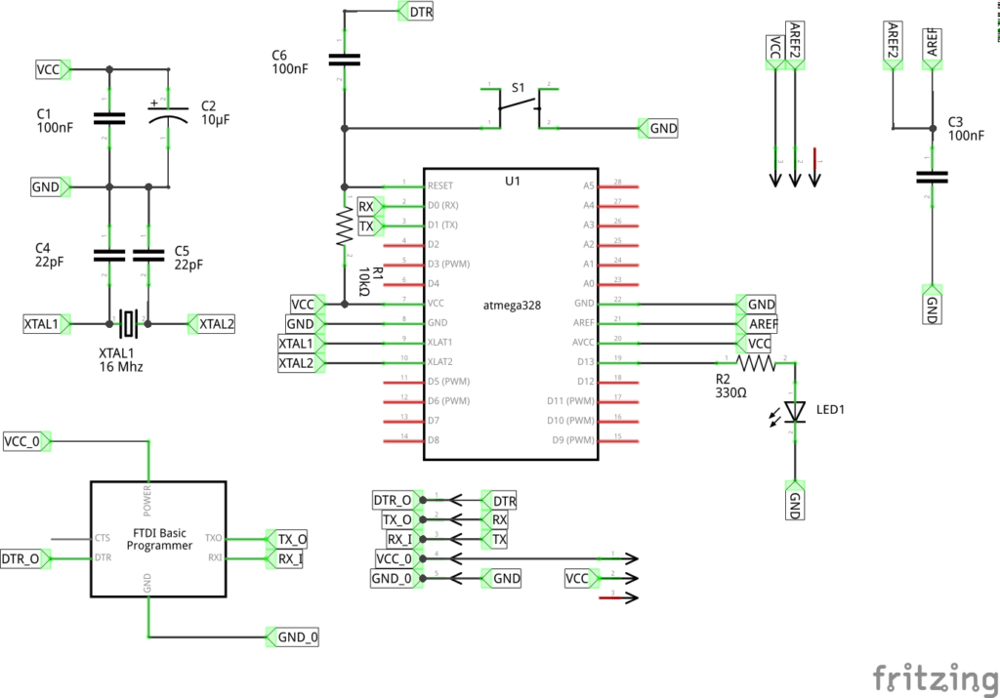

I had an _urgent_ need (!) to build a breadboard version of an Arduino board which I needed to run _without_ the 16MHz crystal and the two 22pF capacitors used by most Arduino boards.

The following steps are what I had to do, as my brand new ATmega328P micro-controller came supplied with an Arduino Uno boot-loader installed. I didn't want that one because it depends on having the 16MHz crystal and that takes up two of the I/O pins, which I might have a good use for, plus I can run it at 3.5V rather than 5V _and_ get extra long life when running off of batteries.

I had to first download the 8MHz configuration files for the Arduino IDE. These were obtained as a zip file from https://www.arduino.cc/en/uploads/Tutorial/breadboard-1-6-x.zip. (My Arduino IDE version is 1.8.6 but this download worked fine.)

The file was copied into my default 'sketchbook' location, which can be found within the Arduino IDE's preferences dialogue. Mine was `/home/norman/Arduino`.

I then had to create a folder named `hardware` within my default sketchbook location, and copy the downloaded zip file into that new folder.

Finally, a quick shutdown and restart of the Arduino IDE and I had, on the _tools->boards_ option, a new Arduino Board, right at the bottom for a bread-boarded 8MHz Arduino with an ATMega328P micro-controller. So far so good.

I built up the circuit on my breadboard, and as the ATMega328P was already configured, and fused, for a 16 MHz crystal, I had to fit one, plus capacitors to get it to work.

The next step should have been simply to select the board as the new one, and burn a boot-loader with the USBTiny programmer. However, that refused to work and gave me messages that the device signature was incorrect and it certainly looked that way as it came back all zeros - not good.

At this point, you should imagine me trying all sorts of fiddles, some blindfold, to get it working - all to no avail. So, eventually, I went back to basics.

I changed the board back to an Uno, and attempted to burn the bootloader - that worked. Hooray!

I uploaded the famous 'blink' sketch to the pseudo Uno. That worked fine.

Then, I chose the new board setting again, and tried once more to burn the boot-loader, and, surprise, surprise, that worked now! Now we are cooking!

So, if it was running at 8MHz, I _should_ be able to pull out the crystal and its two load capacitor friends, and it _should_ still work (It was running the ubiquitous 'blink' sketch at this point) ... drum roll please ....

It worked! I now have a perfectly working 8MHz ATMega328P running on a breadboard, for now, without losing the two pins taken up by the crystal. Job done!

Anyone Interested in the schematics? Here you are:

  

**NormDuino v1.0.0**

A few words about the above:

- The AREF pin is not directly connected to VCC or any other external reference voltage. It goes through a jumper so that it can be connected and disconnected to and from VCC. You do not want a voltage on AREF if you decide to use the internally generated 1.1V reference voltage for the ADC and/or Analogue Comparator. If you do, it lets the magic blue smoke out and the device stops working.
- The 100nF capacitor between AREF and GND is, however, always required, regardless of whether or not AREF itself is connected to any external reference voltage.
- There also a jumper on the main voltage supply. This is so that it can be powered from batteries, or, from an FTDI Programmer which can supply the 5V required to power the AVR while being programmed, or afterwards.
- C4, C5 and XTAL1 are there in case you want to upgrade to an Arduino Uno again and run the device at 5V and 16MHz instead of 3.5V and 8MHz. However, in the configuration I have, they are not required and can be omitted - after you burn the 8MHz boot-loader of course.
- As you can see, I created the schematics with **Fritzing**. I quite like it for a quick and dirty one-off design, but it does drive me mad when I start routing PCBs or trying to get components adjusted to fit the bread-board layout. (It also, sometimes moves captions around - take note of R1's caption - it's not where it was in the original schematic!)
