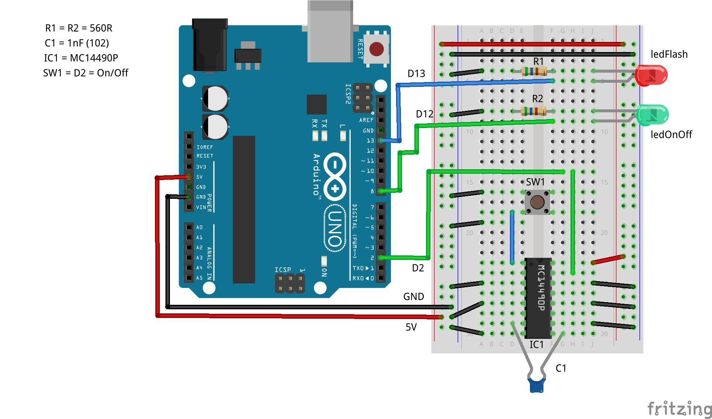
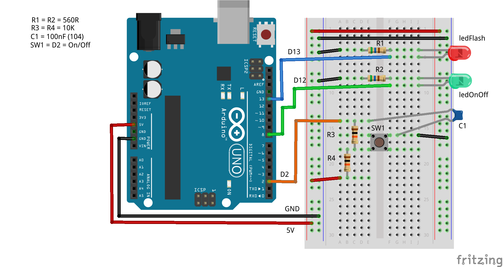

While writing my third Arduino book, Arduino Assembly Language, I needed to determine if interrupts can be used when mixing C++ and Assembly using the Arduino IDE. It turns out that it can be done.

The Arduino IDE uses *avr-g++* to compile the C++ sources (the *.ino files) and *avr-gcc* with the `-assembler-with-cpp` option to run *avr-gas* on any Assembly Language sources. 

All that is required to mix interrupt handlers written in Assembly Language, with code written in C++, is:

* Use the C++ interrupt handler name for the one written in the Assembly source file. For example `INT0_vect` is the handler for the INT0 external interrupt;
* Mark the interrupt handler as `.global`.

That's it!

## Example Sketch

Here's a very simple example where the INT0 interrupt is used to toggle an LED -- what else? It uses a switch on pin `D2` which is pulled up either internally, externally with a 10K resistor or externally with the MC14490P Hex debouncer. When the switch is pressed `D2` goes low and the interrupt fires as it is configured as a falling interrupt trigger.

The obligatory LED on pin `D13`, the built in LED for an UNO board, does its usual thing by blinking every second -- also under control of an Assembly routine.

Be aware that the switch needs to be debounced somehow, as otherwise, the LED will not always follow the switch presses. I use an MC14490P hex debounce chip, but two 10K resistors and a 100nF ceramic capacitor will also work well.

### Sketch: INT0.ino

```C++
//=============================================================
// Demonstrates using interrupt handlers with avr-gas as the
// assembler. In this example, INT0 interrupts toggle an LED
// attached to D12 while the LED on D13 blinks every second.
//=============================================================

//-------------------------------------------------------------
// Define the setup() and toggle() functions to be external
// and written in Assembler.
//-------------------------------------------------------------
extern "C" {
  void setup();
  void toggle();
}

//-------------------------------------------------------------
// I'm only using loop() to toggle the D13 LED and to delay.
// It's easier than writing my own delay() function in 
// Assembler -- for now anyway.
//
// Actually, we don't even need this, but it shows how the 
// interrupt handler can even interrupt a delay() call. Try 
// that without using interrupts!
//-------------------------------------------------------------
void loop() {
  toggle();
  delay(1000);
}
```

Nothing much to see here, we declare the `setup()` and `toggle()` functions to use the C calling convention and that they are defined elsewhere. In the `loop()` function, we simply toggle the LED on pin `D13` every second. Standard "Blink" behaviour.

### Sketch: INT0.S

This file *must* have an extension of an uppercase 'S'. If not, it won't be compiled by the *avr-gcc* compiler and *avr-gas*, the assembler, without errors.

```asm
;--------------------------------------------------------------
; We must do this to __SFR_OFFSET or the various I/O registers
; use their data address and not their I/O address. It's a C++
; thing that we have to undo for Assembly.
;--------------------------------------------------------------
#define __SFR_OFFSET 0

;--------------------------------------------------------------
; Get the register and bit names for the board in use. 
;--------------------------------------------------------------
#include <avr/io.h>

;--------------------------------------------------------------
; Make sure the following code goes into the code, aka text, 
; section.
;--------------------------------------------------------------
.section .text

;--------------------------------------------------------------
; Our setup() and toggle() functions are global so that they 
; can be called from C/C++.
;--------------------------------------------------------------
.global setup
.global toggle

;--------------------------------------------------------------
; The interrupt handler must have the same name as in C/C++ and
; must also be global -- even though it is called by the CPU
; and not explicitly by the C++ code.
;--------------------------------------------------------------
.global INT0_vect

;--------------------------------------------------------------
; In setup we set D12 and D13 as OUTPUT pins for our LEDs. D2,
; where the switch is, is defined as INPUT with an optional
; PULLUP if external pullups are not used. 
;--------------------------------------------------------------
setup:
    sbi DDRB,DDB5       ; D13 is output
    sbi DDRB,DDB4       ; D12 is output
    cbi DDRD,DDD2       ; D2 is input for INT0.
    ; sbi PORTD,PORTD2  ; Internal pullup for D2, if required.

;--------------------------------------------------------------
; Configure the INT0 interrupt as FALLING.
;--------------------------------------------------------------
    ldi r16,(1<<ISC01)|(1<<ISC00)   ; INT0 FALLING
    sts EICRA,r16

;--------------------------------------------------------------
; Enable INT0 and clear any pending INT0 flag notifications to
; avoid spurious triggering at power up. We want the LED off to
; begin with.
;--------------------------------------------------------------
    sbi EIMSK,INT0      ; Enable INT0
    sbi EIFR,INTF0      ; Clear INT0 flag
    ret

;--------------------------------------------------------------
; Toggle the D13 LED. Writing a 1 to a bit in the PIN register
; for an output pin will toggle the pin -- useful!
;
; D13 is PINB bit 5.
;--------------------------------------------------------------
toggle:
    sbi PINB,PINB5
    ret

;--------------------------------------------------------------
; The interrupt handler for the INT0 interrupt. All we do is 
; toggle the D12 bit in the PIN register. Note the use of the
; RETI instruction to return from an interrupt handler. Also
; using a handler will automatically clear the INT0 flag so we
; don't have to.
;
; D12 is PINB bit 4.
;--------------------------------------------------------------
; Toggle D12 on INT0 interrupt (on D2).
INT0_vect:
    sbi PINB,PINB4
    reti
```

All that this code does is initialise the two output pins, `D12` and `D13`; as well as the input pin, `D2`. `D2` defaults to INPUT as I'm using external circuitry to pull the switch high. If your circuit doesn't, uncomment the line 42 to enable internal pullups on `D2`.

The INT0 interrupt is configured to trigger when pin `D2` falls from high to low, it is then enabled and any pending interrupts are cleared. An interrupt will not fire until one instruction has been executed after enabling it, or after returning from an ISR, so the flag is cleared before the pending INT0 gets a chance to trigger.

The `toggle()` function is called from `loop()` to toggle the LED on pin `D13`. It does this by writing to the PIN register for the pin -- the Atmel engineers decided to make use of the input registers, PINx, which would otherwise be unused for output pins. 

The interrupt handler does a similar toggle for the LED on pin `D12`.

## Debouncing the Switch

I used an MC14490P hex debouncer as shown below. It can debounce up to 6 separate switches in pullup or pulldown modes. The switch is pulled up by the MC1440P in this circuit.



If, on the other hand, you don't have a MC14490P handy, a couple of 10K resistors and a 100nF capacitor will do the job, as per the image below. The switch is configured in pullup mode in this circuit.



Of course, if you want to live dangerously, you could remove R3 and C1 from the breadboard layout above, and reposition the orange wire down four holes until it connects to the top of R4. This way, you get a normal pulled up switch, but with no debouncing. Try it and see how well it all works!
